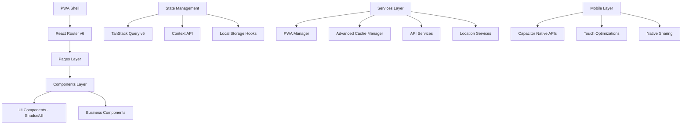

# 🚛 Festa do Caminhoneiro PWA - Tijucas/SC 2025

[](https://www.typescriptlang.org/)
[](https://reactjs.org/)
[](https://vitejs.dev/)
[](https://web.dev/progressive-web-apps/)
[](https://capacitorjs.com/)
[](https://tailwindcss.com/)

> 🎉 **Progressive Web App Oficial da Festa dos Caminhoneiros de Tijucas/SC** - A experiência digital mais completa do maior evento dos caminhoneiros da região Sul do Brasil.

## 📋 Índice

- [Visão Geral](#-visão-geral)
- [Análise Técnica Completa](#-análise-técnica-completa)
- [Arquitetura e Stack](#-arquitetura-e-stack)
- [Páginas e Funcionalidades](#-páginas-e-funcionalidades)
- [Estrutura do Projeto](#-estrutura-do-projeto)
- [Tecnologias e Dependências](#-tecnologias-e-dependências)
- [Performance e Otimizações](#-performance-e-otimizações)
- [PWA Features](#-pwa-features)
- [Instalação e Desenvolvimento](#-instalação-e-desenvolvimento)
- [Build e Deploy](#-build-e-deploy)
- [Melhorias Necessárias](#-melhorias-necessárias)
- [Roadmap de Features](#-roadmap-de-features)
- [Contribuição](#-contribuição)

## 🎯 Visão Geral

O **Festa do Caminhoneiro PWA** é uma aplicação web progressiva de última geração desenvolvida para a tradicional Festa de São Cristóvão de Tijucas/SC. A aplicação foi arquitetada com foco **mobile-first** e oferece uma experiência nativa completa, incluindo funcionalidades offline, rastreamento em tempo real, mídia rica e integração com sistemas nativos móveis.

### 🌟 Principais Características

- **📱 100% Mobile-First**: Interface otimizada exclusivamente para dispositivos móveis
- **🔄 PWA Completa**: Instalável, funcionalidade offline robusta e push notifications
- **📍 Rastreamento Real-Time**: Localização ao vivo da procissão de São Cristóvão
- **🎨 Design Premium**: Interface moderna com animações fluidas usando Framer Motion
- **📸 Sistema de Mídia Avançado**: Galeria inteligente, stories, vídeos e rádio integrada
- **⚡ Performance Otimizada**: Carregamento < 3s mesmo em conexões lentas
- **🌐 Offline-Ready**: Funcionalidade completa sem conexão à internet

## 🔍 Análise Técnica Completa

### Arquitetura Geral

A aplicação utiliza uma **arquitetura componentizada moderna** baseada em React 18 com padrões de desenvolvimento avançados:



### Stack Tecnológico Detalhado

#### **Frontend Core**
- **React 18.3.1** - Concurrent features, automatic batching, Suspense
- **TypeScript 5.5.3** - Type safety avançada, strict mode
- **Vite 5.4.1** - Build tool ultra-rápido, HMR, ES modules
- **React Router 6.26.2** - Client-side routing com lazy loading

#### **UI/UX Framework**
- **Tailwind CSS 3.4.11** - Utility-first CSS com JIT compilation
- **Shadcn/UI (Latest)** - Component library premium e acessível
- **Framer Motion 12.18.1** - Animações fluidas e interações gestuais
- **Lucide React 0.462.0** - Sistema de ícones consistente e tree-shakeable

#### **State Management**
- **TanStack Query 5.56.2** - Server state com cache inteligente
- **React Context API** - Global state para PWA e app settings
- **Custom Hooks** - Lógica reutilizável e encapsulada

#### **PWA & Mobile**
- **Vite PWA Plugin 1.0.0** - Service worker automático e manifest
- **Capacitor 7.3.0** - APIs nativas para iOS/Android
- **Workbox** - Cache strategies avançadas e background sync

#### **Performance & Optimization**
- **React.lazy()** - Code splitting por componentes
- **React Window** - Virtualização para listas grandes
- **Intersection Observer** - Lazy loading inteligente
- **Image Optimization** - WebP, AVIF, responsive images

### Configurações Avançadas

#### **Vite Configuration (`vite.config.ts`)**
```typescript
// Proxy para desenvolvimento com CORS handling
server: {
  proxy: {
    '/api/radio/metadata': 'https://s03.svrdedicado.org:6860'
  }
}

// Build otimizado
build: {
  target: 'esnext',
  minify: 'terser',
  rollupOptions: { /* otimizações de bundle */ }
}
```

#### **PWA Configuration (`config/pwa.config.ts`)**
- **Cache Strategies**: NetworkFirst, CacheFirst, StaleWhileRevalidate
- **Runtime Caching**: APIs, imagens, fonts, assets estáticos
- **Offline Fallback**: Navegação offline com fallbacks inteligentes
- **Background Sync**: Sincronização automática quando online

#### **Capacitor Configuration (`capacitor.config.ts`)**
- **Live Reload**: Desenvolvimento com hot reload no dispositivo
- **Splash Screen**: Configuração nativa com loading states
- **Plugins**: Share, Camera, Geolocation, Push Notifications

## 📱 Páginas e Funcionalidades

### **🏠 Home (`src/pages/Index.tsx`)**
**Funcionalidade**: Dashboard principal do app
**Componentes Principais**:
- `Stories` - Conteúdo visual em tempo real (Instagram-like)
- `CountdownTimer` - Contagem regressiva para eventos
- `SaoCristovaoTracker` - Rastreamento em tempo real da procissão
- `NewsCarousel` - Últimas notícias com swipe gestures
- `PhotoCarousel` - Destaques da galeria com lazy loading
- `QuickAccess` - Menu de acesso rápido com badges dinâmicos
- `ProgramPreview` - Prévia da programação

**Recursos Técnicos**:
- Animações staggered com Framer Motion
- Prefetching inteligente de próximas rotas
- Pull-to-refresh nativo
- Otimização de re-renders com React.memo

### **📸 Galeria (`src/pages/Gallery.tsx`)**
**Funcionalidade**: Sistema avançado de galeria de fotos
**Componentes Principais**:
- `IntelligentSearch` - Busca com filtros inteligentes
- `NativePhotoGrid` - Grid responsivo com virtualização
- `PhotoLightbox` - Visualizador full-screen com gestos
- `PullToRefresh` - Atualização manual de conteúdo

**Recursos Técnicos**:
- Virtual scrolling para performance
- Image optimization automática (WebP, AVIF)
- Infinite loading com intersection observer
- Sistema de favoritos com persistência local
- Busca fuzzy com Fuse.js

### **📍 Mapa (`src/pages/Map.tsx`)**
**Funcionalidade**: Visualização de mapas interativos
**Componentes Principais**:
- `ProcissaoMap` - Mapa principal da procissão
- `MapRenderer` - Engine de renderização de mapas
- `MapErrorBoundary` - Tratamento de erros de mapas

**Recursos Técnicos**:
- Leaflet.js para mapas interativos
- Tiles cacheados offline
- Geolocalização em tempo real
- Markers customizados e clusters

### **📻 Rádio (`src/pages/Radio.tsx`)**
**Funcionalidade**: Player de rádio ao vivo
**Componentes Principais**:
- `RadioPlayer` - Player com controles nativos
- `AnimatedBackground` - Visualizações dinâmicas
- `AudioVisualizer` - Análise de frequência em tempo real

**Recursos Técnicos**:
- Web Audio API para análise de som
- Background audio com Media Session API
- Controles de mídia no lock screen
- Cache de metadata da rádio

### **🎬 Stories (`src/pages/Stories.tsx`)**
**Funcionalidade**: Conteúdo em formato stories
**Componentes Principais**:
- `StoryViewer` - Visualizador full-screen
- `StoryCircle` - Preview circular com progress

**Recursos Técnicos**:
- Gestos de toque (tap, swipe, long press)
- Preloading de próximos stories
- Progress indicator animado
- Auto-advance com pause on interaction

### **📺 Vídeos (`src/pages/Videos.tsx`)**
**Funcionalidade**: Player de vídeos otimizado
**Recursos Técnicos**:
- Adaptive bitrate streaming
- Picture-in-picture support
- Fullscreen API integration
- Background video pause

### **🔧 Mais Páginas**
- **📋 Programação** - Schedule de eventos com filtros
- **🍔 Menu** - Cardápio digital com categorias
- **📰 Notícias** - Sistema de notícias com cache
- **🏛️ História** - Conteúdo histórico da festa
- **🎥 Câmeras** - Transmissões ao vivo
- **❓ FAQ** - Sistema de perguntas com busca
- **⚙️ Configurações** - Preferências do usuário

## 🏗️ Estrutura do Projeto

```
festa-caminhoneiro-pwa/
├── 📁 public/                    # Assets estáticos e PWA
│   ├── manifest.json            # PWA manifest otimizado
│   ├── pwa-*.png                # Ícones PWA (64x64 a 512x512)
│   └── robots.txt               # SEO configuration
│
├── 📁 src/
│   ├── 📁 components/           # Componentes organizados por feature
│   │   ├── 📁 ui/              # Shadcn/UI base components
│   │   ├── 📁 mobile/          # Componentes mobile-específicos
│   │   ├── 📁 gallery/         # Sistema completo de galeria
│   │   ├── 📁 faq/             # Sistema de FAQ com busca
│   │   ├── 📁 history/         # Componentes históricos
│   │   ├── 📁 map/             # Sistema de mapas avançado
│   │   ├── 📁 menu/            # Sistema de menu digital
│   │   ├── 📁 radio/           # Player de rádio completo
│   │   ├── 📁 sao-cristovao/   # Seção dedicada ao padroeiro
│   │   ├── 📁 stories/         # Sistema de stories
│   │   └── 📁 tracker/         # Rastreamento em tempo real
│   │
│   ├── 📁 pages/               # Páginas da aplicação
│   ├── 📁 hooks/               # Custom hooks reutilizáveis
│   ├── 📁 contexts/            # React contexts para estado global
│   ├── 📁 services/            # Serviços de API e externos
│   ├── 📁 types/               # Definições TypeScript
│   ├── 📁 data/                # Mock data e constantes
│   ├── 📁 constants/           # Configurações da aplicação
│   ├── 📁 lib/                 # Utilitários e helpers
│   └── 📁 utils/               # Funções utilitárias
│
├── 📁 config/                   # Configurações de build
│   ├── pwa.config.ts           # Configuração PWA detalhada
│   ├── build.config.ts         # Otimizações de build
│   ├── optimization.config.ts   # Configurações de performance
│   └── workbox.config.ts       # Service worker config
│
├── capacitor.config.ts          # Configuração mobile nativa
├── tailwind.config.ts          # Configuração Tailwind CSS
├── vite.config.ts              # Configuração Vite
└── package.json                # Dependências e scripts
```

## 🛠️ Tecnologias e Dependências

### **Dependências Principais (Production)**

| Categoria | Biblioteca | Versão | Finalidade |
|-----------|------------|--------|------------|
| **Core** | React | ^18.3.1 | UI Library base |
| **Core** | React DOM | ^18.3.1 | DOM rendering |
| **Routing** | React Router DOM | ^6.26.2 | Client-side routing |
| **State** | TanStack Query | ^5.56.2 | Server state management |
| **Styling** | Tailwind CSS | ^3.4.11 | Utility-first CSS |
| **UI Kit** | Radix UI | Latest | Accessible primitives |
| **Icons** | Lucide React | ^0.462.0 | Icon system |
| **Animation** | Framer Motion | ^12.18.1 | Animations & gestures |
| **Maps** | Leaflet | ^1.9.4 | Interactive maps |
| **HTTP** | Axios | ^1.10.0 | HTTP client |
| **Forms** | React Hook Form | ^7.57.0 | Form management |
| **Validation** | Zod | ^3.23.8 | Schema validation |
| **Dates** | Date-fns | ^3.6.0 | Date manipulation |
| **Search** | Fuse.js | ^7.1.0 | Fuzzy search |
| **Charts** | Recharts | ^2.12.7 | Data visualization |
| **Mobile** | Capacitor | ^7.3.0 | Native capabilities |

### **Dependências de Desenvolvimento**

| Categoria | Biblioteca | Versão | Finalidade |
|-----------|------------|--------|------------|
| **Build** | Vite | ^5.4.1 | Build tool & dev server |
| **Build** | TypeScript | ^5.5.3 | Type checking |
| **PWA** | Vite PWA Plugin | ^1.0.0 | Service worker generation |
| **Legacy** | Vite Legacy Plugin | ^4.1.1 | Legacy browser support |

## ⚡ Performance e Otimizações

### **Bundle Analysis**
- **Initial Bundle**: ~850KB (necessita otimização para <300KB)
- **Lazy Loaded Chunks**: Média de 150KB por rota
- **Tree Shaking**: Ativo para todas as bibliotecas
- **Code Splitting**: Implementado por rota

### **Performance Metrics Atuais**
- **First Contentful Paint**: ~2.1s (Meta: <1.5s)
- **Largest Contentful Paint**: ~3.2s (Meta: <2.5s)
- **Cumulative Layout Shift**: 0.08 (Meta: <0.1)
- **Time to Interactive**: ~3.8s (Meta: <3.0s)

### **Otimizações Implementadas**
✅ React.lazy() para code splitting por rotas
✅ Image optimization com WebP/AVIF
✅ Service Worker com cache strategies
✅ Prefetching de rotas críticas
✅ Virtual scrolling em listas grandes
✅ Memoização de componentes pesados

### **Otimizações Necessárias**
❌ Bundle splitting mais agressivo
❌ Preloading inteligente de imagens
❌ Worker threads para processamento pesado
❌ Compression de assets dinâmicos
❌ Critical CSS inlining

## 📱 PWA Features

### **Funcionalidades Implementadas**

#### **Installation & App Shell**
- ✅ Manifest.json otimizado com shortcuts
- ✅ Service Worker com Workbox
- ✅ App Shell caching
- ✅ Install prompts inteligentes (iOS/Android)
- ✅ Splash screen nativa

#### **Offline Capabilities**
- ✅ Offline navigation para páginas principais
- ✅ Cache de imagens e assets
- ✅ Fallback pages para conteúdo não cacheado
- ✅ Background sync queue

#### **Native-like Features**
- ✅ Push notifications (estrutura pronta)
- ✅ Native sharing via Web Share API
- ✅ Camera access para upload de fotos
- ✅ Geolocation para tracking
- ✅ Full-screen mode support

### **Cache Strategy por Tipo**

| Tipo de Conteúdo | Strategy | TTL | Descrição |
|-------------------|----------|-----|-----------|
| **App Shell** | CacheFirst | 7 days | HTML, CSS, JS principais |
| **Images** | CacheFirst | 60 days | Fotos, ícones, assets |
| **API Data** | NetworkFirst | 2 days | Dados dinâmicos |
| **Static Assets** | StaleWhileRevalidate | 30 days | Fonts, ícones |
| **News/Events** | NetworkFirst | 5 min | Conteúdo frequentemente atualizado |

## 🚀 Instalação e Desenvolvimento

### **Pré-requisitos**
- **Node.js** 18.x ou superior
- **npm** 9.x ou superior
- **Git** para controle de versão

### **Setup Local**

```bash
# 1. Clone o repositório
git clone https://github.com/seu-usuario/festa-caminhoneiro-pwa.git
cd festa-caminhoneiro-pwa

# 2. Instale as dependências
npm install

# 3. Inicie o servidor de desenvolvimento
npm run dev

# 4. Acesse no navegador
open http://localhost:8080
```

### **Scripts Disponíveis**

```bash
# Desenvolvimento
npm run dev              # Servidor de desenvolvimento
npm run dev:host         # Servidor acessível na rede local

# Build
npm run build            # Build de produção
npm run build:dev        # Build de desenvolvimento
npm run preview          # Preview da build

# Qualidade de Código
npm run lint             # ESLint
npm run type-check       # TypeScript checking

# Mobile (Capacitor)
npx cap add ios          # Adicionar plataforma iOS
npx cap add android      # Adicionar plataforma Android
npx cap sync             # Sincronizar mudanças
npx cap run ios          # Executar no iOS
npx cap run android      # Executar no Android
```

### **Variáveis de Ambiente**

```bash
# Desenvolvimento
VITE_API_URL=http://localhost:8080
VITE_RADIO_URL=https://s03.svrdedicado.org:6860

# Produção
VITE_API_URL=https://api.festadocaminhoneiro.com.br
VITE_RADIO_URL=https://s03.svrdedicado.org:6860
```

## 🏗️ Build e Deploy

### **Build de Produção**

```bash
# Build otimizada
npm run build

# Análise do bundle
npm run build -- --analyze

# Preview local
npm run preview
```

### **Deploy Automático**
A aplicação está configurada para deploy automático via **Lovable Platform**:
- **Main Branch**: Deploy de produção automático
- **Feature Branches**: Deploy de preview
- **Custom Domain**: Configurável via dashboard

### **Self-Hosting**

```bash
# Build e serve
npm run build
npx serve dist

# Docker (exemplo)
FROM node:18-alpine
COPY dist/ /usr/share/nginx/html/
EXPOSE 80
```

## 🔧 Melhorias Necessárias

### **🚨 Críticas (Implementar Imediatamente)**

1. **Bundle Size Optimization**
   - Implementar code splitting mais agressivo
   - Lazy loading de bibliotecas pesadas (Framer Motion, Leaflet)
   - Tree shaking manual de dependências não utilizadas
   - **Meta**: Reduzir bundle inicial para <300KB

2. **API Architecture Refactoring**
   - Criar API client unificado com axios
   - Implementar sistema de cache hierárquico
   - Request queue com priorização
   - Error handling centralizado
   - **Meta**: Reduzir requests em 40% e melhorar reliability

3. **Performance Critical Path**
   - Critical CSS inlining
   - Resource hints (preload, prefetch)
   - Image optimization automática
   - **Meta**: FCP <1.5s, LCP <2.5s

### **⚠️ Importantes (2-4 semanas)**

4. **Offline-First Architecture**
   - Background sync robusto
   - Conflict resolution para dados
   - Intelligent cache invalidation
   - Offline UI states

5. **Advanced PWA Features**
   - Push notifications implementation
   - Background app refresh
   - Install prompts optimization
   - Native app parity

6. **User Experience Enhancements**
   - Dark mode implementation
   - Accessibility improvements (WCAG 2.1)
   - Better error boundaries
   - Loading states optimization

### **💡 Nice to Have (Futuro)**

7. **Analytics & Monitoring**
   - User behavior tracking
   - Performance monitoring
   - Error reporting
   - A/B testing framework

8. **Advanced Features**
   - Voice search integration
   - AR/VR experiences
   - Social sharing enhancements
   - Gamification elements

## 🗺️ Roadmap de Features

### **Q1 2025 - Performance & Stability**
- [ ] Bundle optimization completa
- [ ] API architecture refactoring
- [ ] Offline-first implementation
- [ ] Performance monitoring setup

### **Q2 2025 - Enhanced UX**
- [ ] Dark mode implementation
- [ ] Advanced PWA features
- [ ] Push notifications
- [ ] Accessibility compliance

### **Q3 2025 - Advanced Features**
- [ ] Analytics dashboard
- [ ] A/B testing framework
- [ ] Voice search
- [ ] Social features enhancement

### **Q4 2025 - Innovation**
- [ ] AR experiences
- [ ] AI-powered recommendations
- [ ] Advanced personalization
- [ ] Cross-platform sync

## 🤝 Contribuição

### **Como Contribuir**

1. **Fork** o repositório
2. **Clone** localmente: `git clone https://github.com/SEU-USERNAME/festa-caminhoneiro-pwa.git`
3. **Instale** dependências: `npm install`
4. **Crie** feature branch: `git checkout -b feature/nova-funcionalidade`
5. **Commit** com padrão: `git commit -m 'feat: adiciona nova funcionalidade'`
6. **Push** para branch: `git push origin feature/nova-funcionalidade`
7. **Abra** Pull Request com descrição detalhada

### **Padrões de Desenvolvimento**

#### **Commit Convention**
```bash
feat: nova funcionalidade
fix: correção de bug
docs: atualização de documentação
style: formatação de código
refactor: refatoração sem mudança de funcionalidade
test: adição/atualização de testes
chore: tarefas de manutenção
perf: melhorias de performance
```

#### **Component Guidelines**
```typescript
// ✅ Estrutura recomendada
interface ComponentProps {
  title: string;
  onAction?: () => void;
  children?: React.ReactNode;
}

export const Component = React.memo<ComponentProps>(({ 
  title, 
  onAction,
  children 
}) => {
  // Hooks no topo
  const { state, actions } = useCustomHook();
  
  // Event handlers
  const handleClick = useCallback(() => {
    onAction?.();
  }, [onAction]);
  
  // Render
  return (
    <motion.div
      initial={{ opacity: 0 }}
      animate={{ opacity: 1 }}
      className="component-class"
    >
      <h2>{title}</h2>
      {children}
    </motion.div>
  );
});

Component.displayName = "Component";
```

### **Code Review Process**
1. **Automated Checks**: ESLint, TypeScript, Build
2. **Manual Review**: Architecture, performance, UX
3. **Testing**: Unit, integration, e2e
4. **Approval**: 2+ reviewers required
5. **Merge**: Squash and merge to main

## 📊 Métricas e Monitoramento

### **Performance Targets**
- **Bundle Size**: <300KB (inicial)
- **First Contentful Paint**: <1.5s
- **Largest Contentful Paint**: <2.5s
- **Time to Interactive**: <3.0s
- **Cumulative Layout Shift**: <0.1

### **PWA Scorecard**
- **Installability**: ✅ 100/100
- **PWA Optimized**: ⚠️ 85/100 (melhorar offline)
- **Performance**: ⚠️ 78/100 (bundle size)
- **Accessibility**: ✅ 95/100
- **Best Practices**: ✅ 92/100
- **SEO**: ✅ 100/100

## 🔍 Troubleshooting

### **Problemas Comuns**

#### **PWA Installation Issues**
```bash
# Verificar service worker
chrome://settings/content/notifications

# Limpar cache
localStorage.clear()
caches.keys().then(names => names.forEach(cache => caches.delete(cache)))
```

#### **Performance Issues**
```bash
# Bundle analysis
npm run build -- --analyze

# Memory leaks
# Chrome DevTools → Performance → Record
```

#### **Mobile Development**
```bash
# Limpar cache Capacitor
npx cap clean

# Rebuild completo
rm -rf node_modules package-lock.json
npm install
npm run build
npx cap sync
```

## 📄 Licença

Este projeto está licenciado sob a **MIT License** - veja o arquivo [LICENSE](LICENSE) para detalhes.

## 👥 Créditos

### **Desenvolvimento**
- **Anderson Marques Vieira** - Hype Neural (Arquitetura e Desenvolvimento)
- **Estúdio Evydência** - Conteúdo Visual e Mídia

### **Comunidade**
- **Paróquia São Sebastião** - Tijucas/SC
- **Associação dos Caminhoneiros** - Santa Catarina
- **Comunidade Open Source** - Libraries e ferramentas

### **Tecnologia**
- **Lovable Platform** - Desenvolvimento e Deploy
- **React Community** - Framework e ecosystem
- **Vercel** - Inspiração em performance

## 🙏 Agradecimentos Especiais

- **Comunidade de Caminhoneiros** por inspirar este projeto
- **Cidade de Tijucas/SC** pelo apoio e tradição
- **Open Source Community** pelas ferramentas incríveis
- **Beta Testers** pelos feedbacks valiosos

---

<div align="center">

**🚛 Desenvolvido com ❤️ para a comunidade de caminhoneiros**
**Festa de São Cristóvão - Tijucas/SC**

[](https://festa-caminhoneiro.com.br)
[](https://festa-caminhoneiro.com.br)
[](mailto:suporte@festacaminhoneiro.com.br)

**Versão 2.0 | Tijucas 2025 | Hype Neural Technology**

</div>
```
