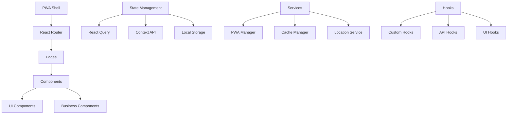

# 🚛 Festa do Caminhoneiro PWA

[](https://www.typescriptlang.org/)
[](https://reactjs.org/)
[](https://vitejs.dev/)
[](https://web.dev/progressive-web-apps/)
[](https://capacitorjs.com/)

> 🎉 **Progressive Web App da Festa do Divino Espírito Santo** - Uma experiência digital completa para o maior evento dos caminhoneiros de Santa Catarina.

## 📋 Índice

- [Visão Geral](#-visão-geral)
- [Arquitetura](#-arquitetura)
- [Tecnologias](#-tecnologias)
- [Funcionalidades](#-funcionalidades)
- [Instalação](#-instalação)
- [Desenvolvimento](#-desenvolvimento)
- [Build e Deploy](#-build-e-deploy)
- [Estrutura do Projeto](#-estrutura-do-projeto)
- [Componentes](#-componentes)
- [PWA Features](#-pwa-features)
- [Mobile Development](#-mobile-development)
- [Contribuição](#-contribuição)
- [Troubleshooting](#-troubleshooting)

## 🎯 Visão Geral

O **Festa do Caminhoneiro PWA** é uma aplicação web progressiva desenvolvida para a tradicional Festa do Divino Espírito Santo de Tijucas/SC. O app oferece uma experiência mobile-first completa, permitindo aos participantes acompanhar a festa em tempo real, acessar informações, galeria de fotos, programação e muito mais.

### 🌟 Destaques

- **📱 Mobile-First**: Interface otimizada para dispositivos móveis
- **🔄 PWA Completa**: Instalável, offline-capable e push notifications
- **🎨 Design Moderno**: Interface premium com animações fluidas
- **📍 Tempo Real**: Rastreamento ao vivo da procissão e eventos
- **📸 Mídia Rica**: Galeria, stories, vídeos e transmissões ao vivo
- **🎵 Rádio Integrada**: Player nativo da rádio oficial do evento

## 🏗️ Arquitetura

### Padrões Arquiteturais



### Principais Conceitos

- **Component-Based Architecture**: Componentes reutilizáveis e modulares
- **Mobile-First Design**: Responsive design com foco em mobile
- **Progressive Enhancement**: Funcionalidades incrementais baseadas em capacidades
- **Performance Optimization**: Lazy loading, code splitting e cache inteligente
- **Accessibility**: WCAG 2.1 compliance e navegação por teclado

## 🛠️ Tecnologias

### Core Stack

| Tecnologia | Versão | Propósito |
|------------|--------|-----------|
| **React** | 18.3.1 | UI Library base |
| **TypeScript** | 5.5.3 | Type safety e developer experience |
| **Vite** | 5.4.1 | Build tool e dev server |
| **React Router** | 6.26.2 | Client-side routing |
| **React Query** | 5.56.2 | Server state management |

### UI & Styling

| Tecnologia | Versão | Propósito |
|------------|--------|-----------|
| **Tailwind CSS** | 3.4.11 | Utility-first CSS framework |
| **Shadcn/UI** | Latest | Component library premium |
| **Framer Motion** | 12.18.1 | Animações e transições |
| **Lucide React** | 0.462.0 | Icon system |
| **Radix UI** | Latest | Accessible primitives |

### Mobile & PWA

| Tecnologia | Versão | Propósito |
|------------|--------|-----------|
| **Capacitor** | 7.3.0 | Native mobile capabilities |
| **PWA Plugin** | 1.0.0 | Service worker e manifest |
| **Vaul** | 0.9.3 | Native bottom sheets |

### Data & APIs

| Tecnologia | Versão | Propósito |
|------------|--------|-----------|
| **Axios** | 1.10.0 | HTTP client |
| **Leaflet** | 1.9.4 | Interactive maps |
| **Fuse.js** | 7.1.0 | Fuzzy search |
| **Date-fns** | 3.6.0 | Date manipulation |

## ✨ Funcionalidades

### 🏠 Dashboard Principal
- **Stories**: Conteúdo visual em tempo real
- **Countdown Timer**: Contagem regressiva para eventos
- **Quick Access**: Acesso rápido às principais funcionalidades
- **News Carousel**: Últimas notícias e atualizações
- **Photo Carousel**: Destaques da galeria

### 📍 Rastreamento em Tempo Real
- **Mapa Interativo**: Localização ao vivo da procissão
- **São Cristóvão Tracker**: Rastreamento da imagem padroeira
- **Câmeras ao Vivo**: Transmissões em múltiplos pontos

### 📱 Mídia e Conteúdo
- **Galeria de Fotos**: Sistema avançado com filtros e busca
- **Vídeos**: Player integrado com playlist
- **Stories**: Interface similar ao Instagram
- **Rádio ao Vivo**: Player nativo da rádio oficial

### 📋 Informações
- **Programação**: Agenda completa dos eventos
- **Cardápio**: Menu digital dos estabelecimentos
- **História**: Conteúdo histórico da festa
- **FAQ**: Perguntas frequentes com busca
- **São Cristóvão**: Seção dedicada ao padroeiro

### 🎯 Funcionalidades Especiais
- **Contato da Igreja**: Modal interativo com status em tempo real
- **Instalação PWA**: Sistema inteligente de prompts
- **Modo Offline**: Cache avançado para funcionalidade offline
- **Push Notifications**: Notificações para eventos importantes

## 🚀 Instalação

### Pré-requisitos

- **Node.js** 18+ 
- **npm** ou **yarn**
- **Git**

### Setup Local

```bash
# 1. Clone o repositório
git clone https://github.com/your-org/festa-caminhoneiro-pwa.git
cd festa-caminhoneiro-pwa

# 2. Instale as dependências
npm install

# 3. Inicie o servidor de desenvolvimento
npm run dev

# 4. Acesse no navegador
open http://localhost:5173
```

### Variáveis de Ambiente

O projeto não utiliza arquivos `.env`. As configurações são gerenciadas através de:

- **Constants**: Arquivo `src/constants/config.ts`
- **Supabase Secrets**: Para chaves privadas (se conectado)
- **Public Keys**: Diretamente no código quando seguras

## 💻 Desenvolvimento

### Scripts Disponíveis

```bash
# Desenvolvimento local
npm run dev

# Build para produção
npm run build

# Build para desenvolvimento
npm run build:dev

# Lint e formatação
npm run lint

# Preview da build
npm run preview
```

### Estrutura de Desenvolvimento

```bash
src/
├── components/          # Componentes reutilizáveis
│   ├── ui/             # Componentes base (Shadcn)
│   ├── mobile/         # Componentes específicos mobile
│   ├── faq/            # Componentes de FAQ
│   ├── gallery/        # Componentes de galeria
│   ├── history/        # Componentes históricos
│   ├── map/            # Componentes de mapa
│   ├── menu/           # Componentes de menu
│   ├── sao-cristovao/  # Componentes de São Cristóvão
│   ├── stories/        # Componentes de stories
│   └── tracker/        # Componentes de rastreamento
├── pages/              # Páginas da aplicação
├── hooks/              # Custom hooks
├── contexts/           # React contexts
├── services/           # Serviços externos
├── types/              # Definições TypeScript
├── data/               # Dados mock e constantes
├── constants/          # Configurações e constantes
└── lib/                # Utilitários e helpers
```

### Padrões de Código

#### Componentes

```typescript
// ✅ Bom - Componente bem estruturado
interface ComponentProps {
  title: string;
  onClick?: () => void;
}

export const Component = React.memo<ComponentProps>(({ 
  title, 
  onClick 
}) => {
  return (
    <motion.div
      initial={{ opacity: 0 }}
      animate={{ opacity: 1 }}
      className="p-4 bg-background"
    >
      <h2 className="text-lg font-semibold">{title}</h2>
    </motion.div>
  );
});
```

#### Hooks Customizados

```typescript
// ✅ Bom - Hook bem estruturado
export function useCustomHook() {
  const [state, setState] = useState(initialState);
  
  const actions = useMemo(() => ({
    action1: () => setState(prev => ({ ...prev, field: value })),
    action2: () => {/* implementation */}
  }), []);
  
  return {
    state,
    ...actions
  };
}
```

#### Naming Conventions

- **Componentes**: PascalCase (`PhotoCard`, `NewsCarousel`)
- **Hooks**: camelCase com prefixo `use` (`useGallery`, `usePWA`)
- **Arquivos**: kebab-case (`photo-card.tsx`, `news-carousel.tsx`)
- **Constantes**: SCREAMING_SNAKE_CASE (`API_BASE_URL`, `CACHE_TTL`)

## 🏗️ Build e Deploy

### Build de Produção

```bash
# Build otimizada
npm run build

# Verificar saída
npm run preview
```

### Deploy Automático

O projeto está configurado para deploy automático via **Lovable Platform**:

1. **Push para main** → Deploy automático
2. **Preview branches** → Deploy de preview
3. **Custom domains** → Configurável via dashboard

### PWA Deployment

```bash
# Verificar PWA
npx lighthouse https://your-domain.com --preset=desktop

# Testar offline
# 1. Abra DevTools → Application → Service Workers
# 2. Marque "Offline"
# 3. Teste a aplicação
```

### Mobile App (Capacitor)

```bash
# Adicionar plataformas
npx cap add ios
npx cap add android

# Build web
npm run build

# Sync para mobile
npx cap sync

# Abrir IDE nativo
npx cap open ios
npx cap open android
```

## 📁 Estrutura do Projeto

### Visão Geral da Arquitetura

```
festa-caminhoneiro-pwa/
├── 📁 public/                    # Assets estáticos
│   ├── manifest.json            # PWA manifest
│   ├── pwa-*.png                # Ícones PWA
│   └── robots.txt               # SEO
├── 📁 src/
│   ├── 📁 components/           # Componentes React
│   │   ├── 📁 ui/              # Shadcn/UI base components
│   │   ├── 📁 mobile/          # Mobile-specific components
│   │   ├── 📁 gallery/         # Componentes de galeria
│   │   ├── 📁 faq/             # Sistema de FAQ
│   │   ├── 📁 history/         # Conteúdo histórico
│   │   ├── 📁 map/             # Funcionalidades de mapa
│   │   ├── 📁 menu/            # Sistema de menu
│   │   ├── 📁 sao-cristovao/   # Seção São Cristóvão
│   │   ├── 📁 stories/         # Sistema de stories
│   │   └── 📁 tracker/         # Rastreamento
│   ├── 📁 pages/               # Páginas da aplicação
│   ├── 📁 hooks/               # Custom React hooks
│   ├── 📁 contexts/            # React contexts
│   ├── 📁 services/            # Serviços externos
│   ├── 📁 types/               # TypeScript definitions
│   ├── 📁 data/                # Mock data e constantes
│   ├── 📁 constants/           # App constants
│   ├── 📁 lib/                 # Utilitários
│   ├── App.tsx                 # Componente raiz
│   ├── main.tsx                # Entry point
│   └── index.css               # Global styles
├── 📁 config/                   # Configurações build
├── capacitor.config.ts          # Capacitor config
├── tailwind.config.ts           # Tailwind config
├── vite.config.ts              # Vite config
└── package.json                # Dependencies
```

### Componentes Principais

#### UI Foundation (`src/components/ui/`)
- **Shadcn/UI Components**: Base design system
- **Custom Extensions**: Touch feedback, loading states
- **Accessibility**: ARIA compliant components

#### Mobile Components (`src/components/mobile/`)
- **Header**: Navigation header with PWA controls
- **BottomNavigation**: Tab-based navigation
- **QuickAccess**: Dashboard quick actions
- **FloatingActionButton**: Context-aware FAB

#### Feature Components
- **Gallery System**: Advanced photo management
- **Map Integration**: Real-time tracking
- **Stories System**: Instagram-like content
- **FAQ System**: Searchable help content

### Custom Hooks (`src/hooks/`)

| Hook | Propósito |
|------|-----------|
| `usePWAManager` | PWA installation e capabilities |
| `useDeviceDetection` | Device type e capabilities detection |
| `useGallery` | Photo gallery management |
| `useStories` | Stories content management |
| `useFAQ` | FAQ search e filtering |
| `useNavigation` | Enhanced routing utilities |
| `useLocalStorage` | Persistent storage utilities |

### Services (`src/services/`)

| Service | Propósito |
|---------|-----------|
| `app-shell` | PWA shell caching |
| `advanced-cache` | Intelligent caching system |
| `api/locationService` | GPS e location services |
| `api/newsService` | News content management |
| `api/storiesService` | Stories API integration |

## 🧩 Componentes

### Design System

O projeto utiliza um design system robusto baseado em **Shadcn/UI** com extensões customizadas:

#### Tokens de Design

```typescript
// Cores principais (src/constants/colors.ts)
export const THEME_COLORS = {
  'trucker-blue': '#1E40AF',
  'trucker-green': '#059669', 
  'trucker-red': '#DC2626',
  'trucker-orange': '#EA580C',
  'trucker-yellow': '#D97706'
};
```

#### Componentes Base

- **Button**: Variantes (primary, secondary, outline, ghost)
- **Card**: Container padrão com glassmorphism
- **Input**: Forms com validation
- **Dialog/Drawer**: Modais nativos
- **Toast**: Notifications system

### Componentes Especializados

#### PhotoGrid (`src/components/gallery/PhotoGrid.tsx`)
```typescript
interface PhotoGridProps {
  photos: Photo[];
  onPhotoClick: (photo: Photo) => void;
  loading?: boolean;
  columns?: number;
}
```

#### StoryCircle (`src/components/stories/StoryCircle.tsx`)
```typescript
interface StoryCircleProps {
  story: Story;
  viewed?: boolean;
  size?: 'sm' | 'md' | 'lg';
  onClick: () => void;
}
```

#### QuickAccessCard (`src/components/mobile/QuickAccess.tsx`)
```typescript
interface QuickAccessItem {
  id: string;
  title: string;
  icon: LucideIcon;
  route: string;
  badge?: QuickAccessBadge;
}
```

## 📱 PWA Features

### Service Worker

O projeto implementa um service worker robusto com:

- **Cache Strategy**: Network-first para API, cache-first para assets
- **Background Sync**: Sincronização em background
- **Push Notifications**: Notificações nativas
- **Offline Fallback**: Páginas offline customizadas

### Manifest Configuration

```json
{
  "name": "Festa do Caminhoneiro",
  "short_name": "Festa Caminhoneiro",
  "description": "Festa do Divino Espírito Santo - Tijucas/SC",
  "theme_color": "#1E40AF",
  "background_color": "#ffffff",
  "display": "standalone",
  "start_url": "/",
  "icons": [
    {
      "src": "/pwa-192x192.png",
      "sizes": "192x192",
      "type": "image/png"
    }
  ]
}
```

### Installation Prompts

Sistema inteligente de instalação com:

- **Device Detection**: iOS, Android, Desktop
- **User Engagement**: Baseado em scroll e tempo
- **Smart Timing**: Evita spam de prompts
- **Native UX**: Instruções específicas por plataforma

### Cache Management

```typescript
// Cache estratégico
const CACHE_CONFIG = {
  API_TTL: 5 * 60 * 1000,        // 5 minutos
  STATIC_TTL: 24 * 60 * 60 * 1000, // 24 horas
  IMAGE_TTL: 7 * 24 * 60 * 60 * 1000 // 7 dias
};
```

## 📱 Mobile Development

### Capacitor Integration

O projeto está configurado para desenvolvimento mobile nativo via **Capacitor**:

```typescript
// capacitor.config.ts
export default {
  appId: 'app.lovable.6a4cbc5b381a4084bdebfb77b8417e3f',
  appName: 'caminhoneiro-pwa-festa',
  webDir: 'dist',
  server: {
    url: 'https://6a4cbc5b-381a-4084-bdeb-fb77b8417e3f.lovableproject.com',
    cleartext: true
  }
};
```

### Native Features

- **Native Sharing**: Via Capacitor Share plugin
- **Camera Access**: Para upload de fotos
- **GPS Location**: Rastreamento preciso
- **Push Notifications**: Notificações nativas
- **File System**: Cache de mídia offline

### Mobile Testing

```bash
# iOS (requer macOS + Xcode)
npx cap add ios
npx cap run ios

# Android (requer Android Studio)
npx cap add android  
npx cap run android

# Live Reload
npx cap run ios --live-reload --external
npx cap run android --live-reload --external
```

### Performance Mobile

- **Lazy Loading**: Componentes e imagens
- **Image Optimization**: WebP com fallbacks
- **Bundle Splitting**: Code splitting por rota
- **Touch Optimization**: 44px minimum touch targets
- **Haptic Feedback**: Feedback tátil nativo

## 🤝 Contribuição

### Getting Started

1. **Fork** o repositório
2. **Clone** seu fork: `git clone https://github.com/SEU-USERNAME/festa-caminhoneiro-pwa.git`
3. **Instale** dependências: `npm install`
4. **Crie** uma branch: `git checkout -b feature/nova-funcionalidade`
5. **Commit** suas mudanças: `git commit -m 'feat: adiciona nova funcionalidade'`
6. **Push** para a branch: `git push origin feature/nova-funcionalidade`
7. **Abra** um Pull Request

### Padrões de Commit

Utilizamos **Conventional Commits**:

```bash
feat: adiciona nova funcionalidade
fix: corrige bug específico
docs: atualiza documentação
style: mudanças de formatação
refactor: refatora código existente
test: adiciona ou atualiza testes
chore: tarefas de manutenção
```

### Code Review Process

1. **Automated Checks**: ESLint, TypeScript, Tests
2. **Manual Review**: Code quality, architecture
3. **Testing**: Functional e visual testing
4. **Approval**: 2+ approvals necessários
5. **Merge**: Squash and merge to main

### Development Guidelines

#### Component Development

```typescript
// ✅ Bom exemplo
export const ComponentName = React.memo<ComponentProps>(({ 
  prop1, 
  prop2,
  onAction 
}) => {
  const { state, actions } = useCustomHook();
  
  const handleClick = useCallback(() => {
    onAction?.();
  }, [onAction]);
  
  return (
    <motion.div
      initial={{ opacity: 0 }}
      animate={{ opacity: 1 }}
      className="component-class"
    >
      {/* Component content */}
    </motion.div>
  );
});
```

#### Testing Requirements

- **Unit Tests**: Custom hooks e utilities
- **Integration Tests**: Component interactions
- **E2E Tests**: Critical user flows
- **Accessibility Tests**: WCAG compliance
- **Performance Tests**: Lighthouse scores

## 🔧 Troubleshooting

### Problemas Comuns

#### PWA não instala

```bash
# Verificar HTTPS
# Verificar manifest.json
# Verificar service worker registration
# Testar em dispositivo real
```

#### Performance Issues

```bash
# Analisar bundle size
npm run build -- --analyze

# Lighthouse audit
npx lighthouse https://localhost:5173 --view

# Memory leaks
# Chrome DevTools → Performance
```

#### Mobile Build Failures

```bash
# Limpar cache
npx cap clean

# Rebuild
npm run build
npx cap sync

# Verificar config
npx cap doctor
```

### Debug Mode

```typescript
// Ativar logs detalhados
localStorage.setItem('DEBUG_MODE', 'true');

// Ativar PWA debug
localStorage.setItem('PWA_DEBUG', 'true');

// Performance monitoring
localStorage.setItem('PERF_MONITOR', 'true');
```

### Known Issues

| Issue | Status | Workaround |
|-------|--------|------------|
| iOS Safari PWA install | ✅ Resolvido | Smart detection system |
| Android Chrome performance | 🔄 Em progresso | Lazy loading otimizado |
| Offline image caching | ✅ Resolvido | Advanced cache strategy |

### Support Channels

- **GitHub Issues**: Bug reports e feature requests
- **Discussions**: Perguntas gerais e dicas
- **Discord**: Chat em tempo real
- **Email**: suporte@festacocaminhoneiro.com.br

---

## 📄 Licença

Este projeto está licenciado sob a MIT License - veja o arquivo [LICENSE](LICENSE) para detalhes.

## 👥 Time de Desenvolvimento

- **Frontend**: React + TypeScript specialists
- **PWA**: Progressive Web App experts
- **Mobile**: Capacitor development team
- **Design**: UI/UX design specialists
- **DevOps**: Deployment e infrastructure

## 🙏 Agradecimentos

- **Paróquia São Sebastião** - Tijucas/SC
- **Comunidade de Caminhoneiros** - Santa Catarina
- **Lovable Platform** - Development platform
- **Open Source Community** - Libraries e tools

---

<div align="center">

**🚛 Feito com ❤️ para a comunidade de caminhoneiros de Santa Catarina**

[Website](https://festa-caminhoneiro.com.br) • [PWA Install](https://festa-caminhoneiro.com.br) • [Support](mailto:suporte@festacaminhoneiro.com.br)

</div>
